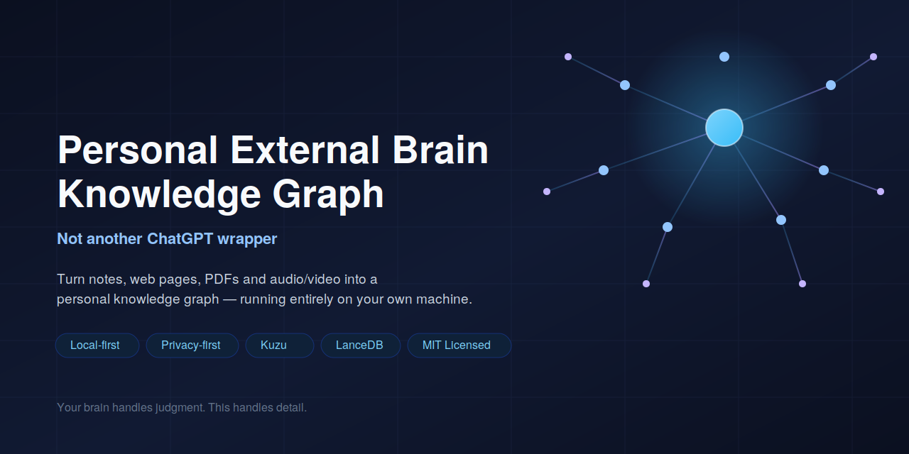

# Personal External Brain Knowledge Graph

[English](README.md) | [简体中文](README.zh-CN.md)

## What is this?

Ever read something useful, took a note, or got a great answer from an AI conversation — and a few weeks later couldn't find it again, or worse, couldn't remember *why* you believed it?

This project isn't trying to help you remember more. It's trying to make sure that when you need to recall something, you get back the exact right piece — with its original source, context, and reasoning intact.

## Design Philosophy: Your Brain Handles Judgment, the System Handles Detail

The design follows a simple division of labor:

- **Your brain owns**: principles, trade-offs, and the mistakes you've already learned from — things that require real understanding
- **The system owns**: concrete examples, step-by-step procedures,original sources, and raw data — things that should never rely on memory

It doesn't think for you. It hands back the exact reasoning and evidence you had at the time, when you actually need it.

## Why It Says "I Don't Know" — On Purpose

Most AI note-taking tools optimize for always having an answer. This one does the opposite: **refusal rate is one of the quality metrics.** When the graph doesn't have reliable enough grounding, it says so instead of generating a plausible-sounding guess. That's what makes every answer it does give something you can actually trust.
</br>


## Features

- Multi-format ingestion: notes, web pages, Markdown, PDFs, audio/video automatically extracted and linked into the graph
- Topic-isolated recall: retrieval scoped by topic, so unrelated domains never contaminate each other
- Single-question scoring: every retrieved fact is scored for confidence
- Decision tracking: log a decision and its real-world outcome, closing the feedback loop over time

## Tech Stack

- Graph database: Kuzu
- Vector store: LanceDB
- Backend: Python 3.11/3.12
- Frontend: React (Node 18+)
- Local-first — your data never leaves your machine

Personal External Brain Knowledge Graph aims to:

1. **Offload** — details are retrievable and checkable; you only keep what should be internalized.
2. **Fit** — return the layer that matches the current topic and situation, not a ten-paragraph summary.
3. **Raise the ceiling** — surface conflict, hang mistakes on the graph, let judgment accumulate. The software does not promise that you become smarter. It can lower the working-memory tax so practice and decisions compound.

Quality is **refusal rate** and **whether you can open the original span**. Not ingest volume. Not how fluent the dialogue sounds. Answering “unknown” is a feature.

## Five layers, one loop

| Layer | Person | Exobrain | Together |
|---|---|---|---|
| **Layer** | Principles, tradeoffs, your mistakes | Examples, steps, sources, numbers | Direct answer = claims to internalize; details under “look up when needed” |
| **Pack** | Decide which layer this batch belongs to | Gate, extract, hang, human confirm | After reading / a meeting, hang onto an existing model. Do not start a second textbook |
| **Recall** | Speak from the current situation | Topic lock, evidence subgraph, misconceptions, last decision | The fitting layer comes back, not a mixed-topic summary |
| **Practice** | Actually change wording and judgment | Probe, grade, reinforce, opposition | Hang the wrong take on the right claim; force it back when related |
| **Compound** | Decide, write the outcome | Brief, similar decisions, weekly review | The next similar question carries the last choice |

These five are wired to the same loops. They are not five products.

## What works now

A local personal workbench, not a slide deck:

- **Ingest**: scratch notes, web pages, Markdown, PDF (including scans), audio, video. Five gates refuse listicles by default. A claim must match a `source_span` in the original.
- **Hang**: extract claims only; new chapter names become concepts only after you confirm. Pending hangs split into “internalize” / “leave on the graph”.
- **Today’s desk**: Next steps list only the current topic (to hang / to review / due practice / to retrospect). Plays are only “after this article” / “after the meeting”, not a plugin store.
- **Recall**: topic lock, keep / lookup layers, use-to-reinforce, play-context weighting. Unknown does not invent nodes.
- **Learn**: direct answer / look up when needed / evidence / analogy / boundary. “This is the same kind of tradeoff as your existing X” only along existing edges; if there is no edge, stop until you mark related. One probe; grading is only correct / missing / opposite.
- **Decide**: options, evidence, unknown, strongest objection; adopting requires a reason; outcomes write back. Similar questions bring the last choice.

The seed topic runs end to end: “Should personal knowledge be a graph instead of a note pile?”

Not promised, and not pretended: reliable auto-abstraction, guaranteed intelligence, mind-reading recall, expert curricula, multimodal thought-structure ingest, multi-user cloud sync by default. Those sit in [ROADMAP.md](./ROADMAP.md). Contribute along the constitution. Do not trade them for refusal rate.

## What it is not

- Not a ChatGPT wrapper. It does not invent an encyclopedia off-graph.
- Not full-text note search: no claims, conflicts, or decisions means this is the wrong project.
- Not a dump-everything embedding store.
- Not a thousand-person society / world sim / skill store / industry ontology.

## Contributing

The pattern is **one constitution**, not parallel features. Useful work: make the existing loops sturdier, add tests that “unknown does not invent” and “answers must cite claim ids”, keep docs aligned with contracts.

1. Read the hard rules in [PROJECT.md](./PROJECT.md) (Chinese), then [ROADMAP.md](./ROADMAP.md).
2. Land the next item on that list (or one unfinished capability you claim). Do not start a second entry point.
3. A new capability must name the error class it kills: cannot find, used wrong, cannot transfer, repeat fall, overload.
4. Contracts live in [contracts/](./contracts/). Do not rename Python / TypeScript fields on a whim.
5. Tests force in-memory graph and vectors; they do not touch `data/`:

```bash
cd backend
python -m venv .venv
# Windows: .venv\Scripts\python -m pip install -e ".[dev]"
# macOS / Linux: .venv/bin/python -m pip install -e ".[dev]"
.venv/bin/python -m pytest          # macOS / Linux
.\.venv\Scripts\python.exe -m pytest  # Windows
```

Issues and PRs should say which loop changed and how you check “unknown / do not invent nodes”. Turning this into a generic assistant, a plugin marketplace, or default cloud sync is off-constitution.

## Security

This is a **single-user, no-login**, local-first tool. Anyone who can reach the ports can read and write the graph and inbox.

1. Copy `.env.example` to `.env` and put in your own key. **Do not commit `.env`.**
2. This repository does not track `.env`. If a fork’s history ever contained a key, rotate it at the gateway.
3. `API_HOST` / `WEB_HOST` default to loopback. Do not map unauthenticated ports to the public internet.
4. Personal knowledge stays in `./data/`. Do not push that directory.

## Start

Needs Node.js 18+ and Python 3.11 or 3.12. Copy `.env.example` to `.env` and set an [OpenAI API key](https://platform.openai.com/api-keys). Requests go to `https://api.openai.com/v1` by default; embeddings reuse the same key. With an empty key, heuristics still boot, but they are not for real use.

Any OpenAI-compatible endpoint (Azure, vLLM, a gateway) works: change `LLM_BASE_URL`. Do not set `LLM_CALLER` for the official API.

Docker:

```bash
docker compose up -d --build
```

- Workbench: http://localhost:3000 (or `WEB_PORT` in `.env`)
- API docs: http://localhost:8000/docs (or `API_PORT` in `.env`)

If the container must reach a compatible gateway on the host, set `LLM_BASE_URL` / `EMBEDDING_BASE_URL` to `http://host.docker.internal:<port>/v1`.

Local:

```bash
npm install
npm --prefix web install

cd backend
python -m venv .venv
# Windows
.\.venv\Scripts\python.exe -m pip install -e .
# macOS / Linux
.venv/bin/python -m pip install -e .
cd ..

npm run dev
```

`npm run setup` does the same install path on Windows and Unix.

- Workbench: http://localhost:3000
- Guide: http://localhost:3000/guide
- API: http://localhost:8000/docs (the frontend proxies `/v1/*`)

Graph default is Kuzu (`data/graph.kuzu`), workbench state is `data/workspace.json`, vectors default to LanceDB (`data/vectors`).


## License

This project is released under the [MIT License](./LICENSE). You're free to use, modify, and distribute it, including for commercial purposes, provided the original copyright notice is retained.

## Support & Contact

This is a very early-stage project — the architecture and interactions are still changing quickly. If you run into issues, have ideas, or just want to push back on a design decision, these are the best ways to reach us:

- **Contribution guide**: see [PROJECT.md](./PROJECT.md) before opening a PR
- **Direct contact**: *(add your preferred email or contact method here)*

We'd rather hear "this doesn't work for me" early than get a polite star
and silence — honest feedback at this stage is worth more than praise.
